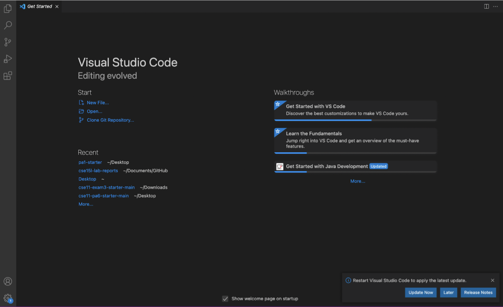
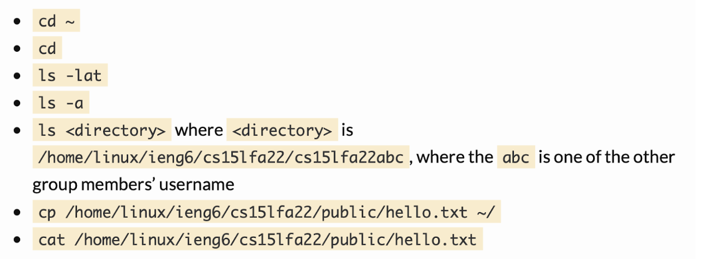
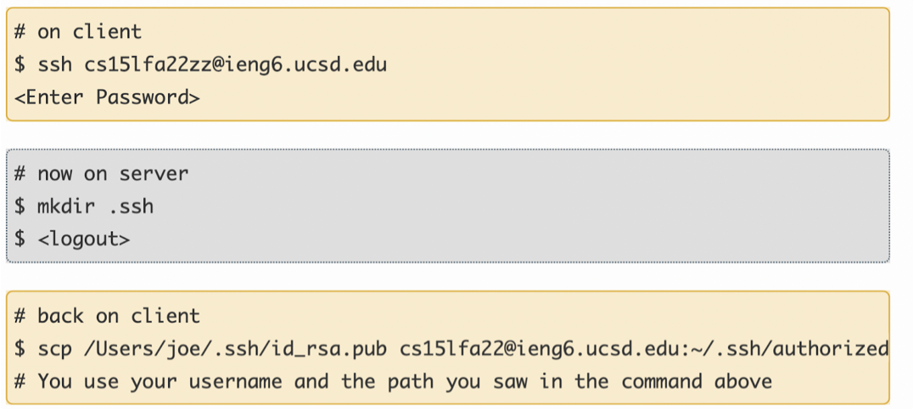

Lab Report Week 1 

This is a tutorial on how to login into the remote computer called ieng6 here at UCSD (for course specific purposes). The process can be broken down into 6 distinct and important steps, all of which will be outlined in detail below.

Installing VScode

Many of you might already have this program installed, but if you don’t it’s important to have VScode installed on your computer. VScode is a powerful code editor that allows you to run most programs on, and for the sake of this course it is the editor used. (I personally already had VScode installed, so I did not have to do this step)
First, go to https://code.visualstudio.com/download and download the appropriate version for your device
The opening screen should look like the image below
This now allows you to create, edit, open and compile programs (VScode also has a terminal you can run command lines from)

Now that you have VScode installed, you have to remotely connect to the ieng6 computer from your terminal (you do this either from the VScode terminal or your computer’s terminal)
To connect remotely, you will first have to open the terminal and make sure you are in your home directory (to do this, just type cd ~ into the terminal and this will put you in your home terminal)
Then, type the command ssh followed by your account name (should look something like this)

 The command line prompt should look something like this 

after entering the ssh prompt, it will ask you for your password which you will have to change beforehand to access the ieng6 computer.

Trying some commands
Now that you have VScode and have gotten into the SSH, we are going to be running some commands (both locally on your computer, and remotely through ssh)
Try running some of the commands below by simply typing them into the terminal and see what the output looks like

Try to understand what the output of each of these commands is, and how it could be useful to run these commands

Moving Files with SCP 
SCP stands for secure copy protocol, and is commonly used to copy files/folders on networks.
To use SCP, first you need to ensure that you are running it from your computer (so not when you are logged into ieng6)
The format for using SCP is as follows: scp <filename(with extension at the end)> <account information (same as used for logging into ssh) + path you want file to be on> (reference image below)

After this step, you will be asked for the same password again, and you will have to login to ssh. Then, once you're in ssh, you are now able to run this file from the ieng6 computer instead of locally on your own!

Setting an SSH key

Because having to type your password every time you want to use SCP is time consuming, we are going to set up an SSH key, which is going to save us a lot of time when trying to log in.
The command to begin this process is shown in the image below                       ( ssh-keygen )

Then, follow the prompts that appear on the terminal and you will now have two new files on your computer (a private and public key, which you can find in the .ssh directory)
Now, it’s important to copy your public key to your user account on the ieng6 server (Note: After many attempts in lab, I am not able to sign into the ssh (presumably because the password reset tool is taking a long time), so I will be using screenshots provided to us to show how this process works) The whole process is shown in the image below (note: the # followed by words is not a command, simply showing you what computer the following command is running from)

You should now be able to login without a password (using your username and the path the public key is stored on)
Optimizing Remote Running
Optimizing remote running is important to save time when working, and since there are a lot of built-in shortcuts, it’s useful to know a couple. Here are some I use frequently:
Using the up arrow key to go back to the last command is helpful (especially for compiling and running programs after fixing a bug)
Have your passwords and logins easily accessible (on a clipboard or text file) so that you don't forget them and you are able to copy and paste them (I have all my login information on a google doc and a clipboard I can copy and paste from)
As you use the terminal more and work on more projects, you will pick up more shortcuts to speed up your workflow
