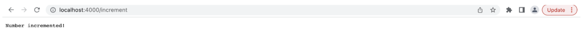
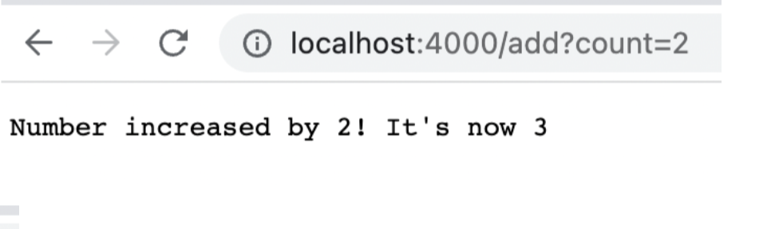

Part 1

The code for the URL handler is: 

> import java.io.IOException;
import java.net.URI;

class Handler implements URLHandler {
    // The one bit of state on the server: a number that will be manipulated by
    // various requests.
    int num = 0;

    public String handleRequest(URI url) {
        if (url.getPath().equals("/")) {
            return String.format("Number: %d", num);
        } else if (url.getPath().equals("/increment")) {
            num += 1;
            return String.format("Number incremented!");
        } else {
            System.out.println("Path: " + url.getPath());
            if (url.getPath().contains("/add")) {
                String[] parameters = url.getQuery().split("=");
                if (parameters[0].equals("count")) {
                    num += Integer.parseInt(parameters[1]);
                    return String.format("Number increased by %s! It's now %d", parameters[1], num);
                }
            }
            return "404 Not Found!";
        }
    }
}

class NumberServer {
    public static void main(String[] args) throws IOException {
        if(args.length == 0){
            System.out.println("Missing port number! Try any number between 1024 to 49151");
            return;
        }

        int port = Integer.parseInt(args[0]);

        Server.start(port, new Handler());
    }
}

The photo above calls an increment function, which creates the array (if it is the first iteration), and begins storing the number of times you refresh the page.

The photo above takes in the url, and because the url contains (/add), it moves to the 2nd block of code which contiains the if statement including the /add. the url is then split into a before and after the = sign, and then it takes the index [1] (which is the number after the string), and adds it into the num output which is displayed on the screen.

Part 2

For the method **averageWithoutLowest** in ArrayExamples.java, the failure inducing input is shown below (the failure inducing input is two lowest element)

>  @Test
  public void testAverage() {

    double[] input4 = {2, 2, 4, 6};
    ArrayExamples.averageWithoutLowest(input4);
 assertEquals(4, ArrayExamples.averageWithoutLowest(input4), 1e-15);
  }

  The symptom is:

  > Caused by: java.lang.AssertionError: expected<3> but was:<5> 
  at org.junit.Assert.fail(Assert.java89)
  at org.junit.Assert.failNotEquals(Assert.java:853)
  at org.junit.Assert.assertEquals(Assert.java:120)]

  and the bug, or code fix needed to solve the bug is:

>   static double averageWithoutLowest(double[] arr) {
    
    if(arr.length < 2) { return 0.0; }
    double lowest = arr[0];
    for(double num: arr) {
      if(num < lowest) { lowest = num; }
    }
    double sum = 0;
    boolean remove = false;
    for(double num: arr) {
      if(!remove && num == lowest) { remove = true ;
      } else
        sum += num; 
    }
    return sum / (arr.length - 1);
  }
  
  The way to solve the bug is to create a boolean which keeps track if a lowest value has been removed, and if it has been removed, to no longer remove and more values and instead continue with the computation

  For the method **ReverseInPlace**, the failure inducing input is any array over two elements, since the method does not keep track of the index and and thus does not reverse correctly. Here is the test that breaks it
  > @Test 
  public void testReversePlace() {

      int[] input = {1, 2, 3};
      ArrayExamples.reverseInPlace(input);
      assertArrayEquals(net int[] {3, 2, 1}, input);
  }

  the symptoms or output is:

  >Causeed by: java.lang.AssertionError: expected<3> but was:<1>
  at org.junit.Assert.fail(Assert.java:89)
  at org.junit.Assert.fail(Assert.java:835)
  at org.junit.Assert.fail(Assert.java:120)
  at org.junit.Assert.fail(Assert.java:146)

  and the way to fix the bug is to create a second for loop which copies over the output array to the new array. By having this second for loop, we are copying back the elements in the correct order

  > static void reverseInPlace(int[] arr) {

      int[] output = new int[arr.length];

      for(int i = 0; i < arr.length; i += 1>) {
          output[i] = arr[arr.length - i - 1];
      }
      for (int i = 0; i < arr.length ; i++) {
          arr[i] = output[i];
      }
  }

  The filter method in ListExamples has a bug which inputs the checked strings backwards. The failure inducing input is any array with over two elements.
  > @Test
  public void testListExamples() {
      List<String> input = new ArrayList<>();
      input.add("Matt);
      input.add("Kyle);
      input.add("Austin");

      StringChecker sc = new StringChecker() {
          public boolean checkString(String s) {
              return true;
          }
      }
  }

  The symptom is:
  > 1) testListExamples(ListTests)
  arrays first differed at element [0]; expected:<[Matt]> but was:<[Austin]>
  at org.junit.internal.ComparisonCriteria.arrayEquals(ComparisonCriteria.java:78)
  at org.junit.internal.comparisonCriteria.arrayEquals(ComparisonCriteria.java:28)
  at org.junit.Assert.internalArrayEquals(Assert.java:534)

  To fix this, I changed the (0) to (s), so that the array would index properly

>   static List<String> filter(List<String> list, StringChecker sc) {

    List<String> result = new ArrayList<>();
    for(String s: list) {
      if(sc.checkString(s)) {
        result.add(s);
      }
    }
    return result;
  }