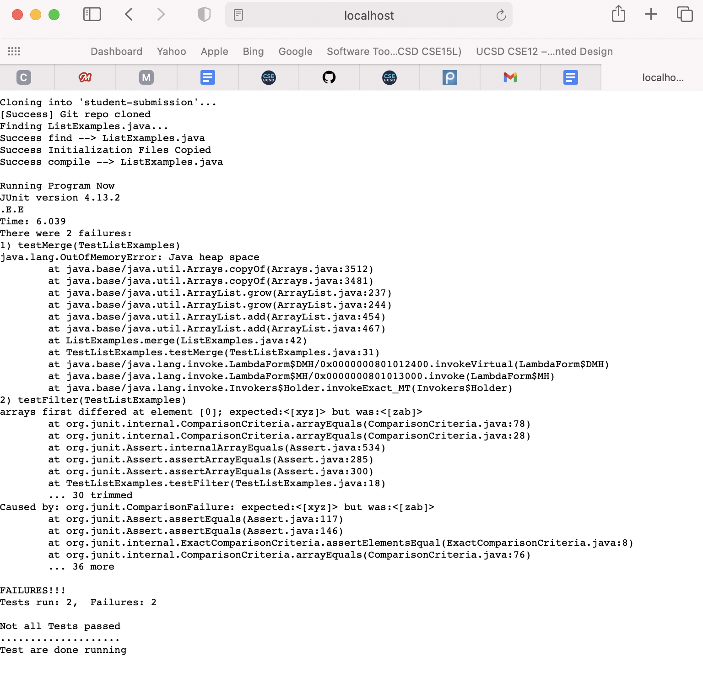
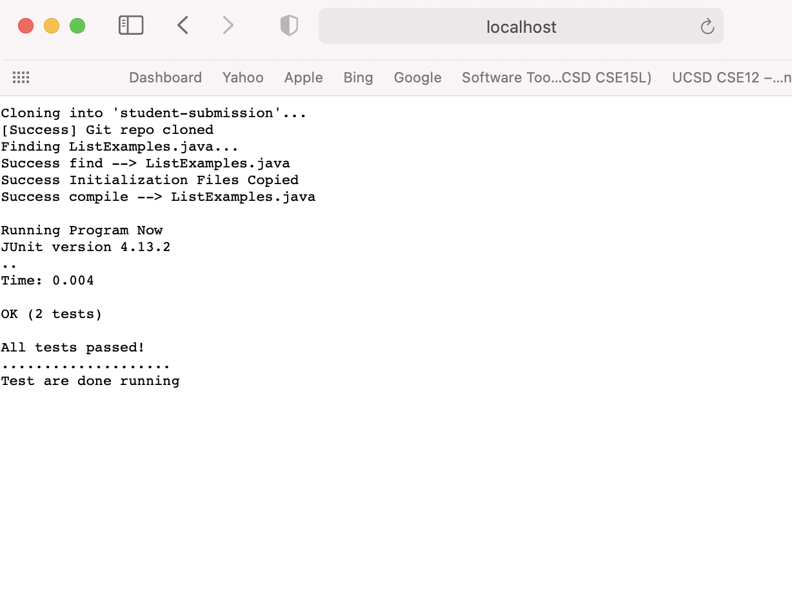
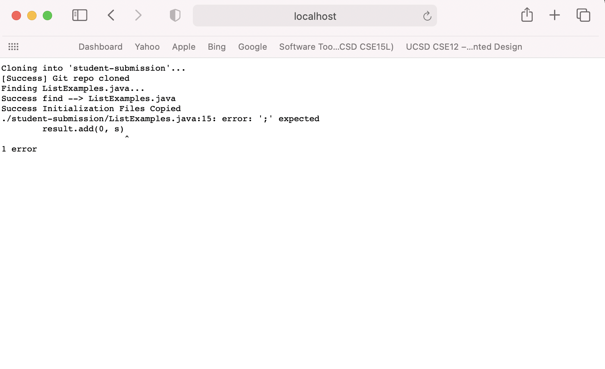

# Lab Report 5

Here is my grade.sh script 

 

        set -e

        rm -rf student-submission
        git clone $1 student-submission

        echo "[Success] Git repo cloned"

        FILE="ListExamples.java"

        echo "Finding $FILE..."
        cd student-submission

        if test -f "$FILE"; then
            echo "Success find --> ListExamples.java"
        else 
            echo "Success find --> ListExamples.java"
            exit
        fi
        cd ..

        cp "TestListExamples.java" student-submission
        echo "Success Initialization Files Copied"

        javac -cp ".:lib/hamcrest-core-1.3.jar:lib/junit-4.13.2.jar" ./student-submission/*.java
        if [ $? -eq 0 ]; then
            echo "Success compile --> $FILE"
        else
            echo "Failed compile --> $FILE"
            exit
        fi

        set +e

        echo ""
        echo "Running Program Now"

        cd student-submission
        java -cp ".:../lib/junit-4.13.2.jar:../lib/hamcrest-core-1.3.jar" org.junit.runner.JUnitCore TestListExamples
        if [ $? -eq 0 ]; then
            echo "All tests passed!"
        else
            echo "Not all Tests passed"
        fi
        echo "...................."
        echo "Test are done running"

## Below Is The 3 screenshots of this script running on student submissions

1. The URL For the below image is: http://localhost:4000/grade?repo=https://github.com/ucsd-cse15l-f22/list-methods-lab3

 

2. The URL For the below image is: https://github.com/ucsd-cse15l-f22/list-methods-corrected

3. The URL for the screenshot below is http://localhost:4000/grade?repo=https://github.com/ucsd-cse15l-f22/list-methods-compile-error

# Tracing The Script

I will choose my 3rd option for tracing the script (URL: http://localhost:4000/grade?repo=https://github.com/ucsd-cse15l-f22/list-methods-compile-error)

**Line 3: set -e** - this line allows the code to stop executing as soon as it reaches an exit code that is non-zero

**Line 5: rm -rf student-submission** - this removes the directory student-submission and all its subdirectories, it has exit code 0, it has no stderr or stdout (If the file were not found, it would of output an stderr)

**Line 6: git clone $1 student-submission** - this line clones the inputted argument and puts it in a directory called student-submission, it has exit code 0, and in this case it doesn't have stderr (its stdout would )

**Line 8: echo "success git repo cloned"** - this line prints outs the words in quotes. It has exit code 0 and has no stderr. (its stdout is the text it prints to terminal)

**Line 12: echo "Finding %File.."** - this line prints outs the words in quotes (File is a variable we declared as the file we are working on). It has exit code 0 and has no stderr (its stdout is the text it prints to terminal)

**Line 13: cd student-submission** - this command moves the current directory to student-submission. It has exit code 0 and has no stderr or stdout.

**Line 15: if test -f "$FILE"; then** - this if statement evaluates to true because the file was found

**Line 17: else** - this line does not run because the if statement above it executed to true

**Line 16:Echo "success find --> Listexamples.java".** It has exit code 0 and has no stderr, its stdout is what it prints to terminal

**Line 21: cd ..** - This moves the current directory back to 1 previous directory. It has exit code 0 and no stderr or stdout

**Line 23: cp "TestListExamples.java" student-submission** - this line copies the file "TestListExamples.java" into student-submission. It has exit code 0 and has no stderr or stdout

**Line 24: echo "Success Initialization Files Copied"** - this file prints out the words in quotes. It has no std err, it has exit code 0, and its stdout is the words it prints.

**Line 26: javac -cp ".:lib/hamcrest-core-1.3.jar:lib/junit-4.13.2.jar" ./student-submission/*.java** - this line runs the student-submission file through junit and compiles it. It has exit **code non zero**, and its where the grade.sh file stops executing. It's stderr is "./student-submission/ListExamples.java:15: error: ';' expected result.add(0, s)"

Because this file failed to compile, and there is a set -e and set +e in the bash script, the file stopped executing at line 26 and printed out the junit error that it found while trying to compile.